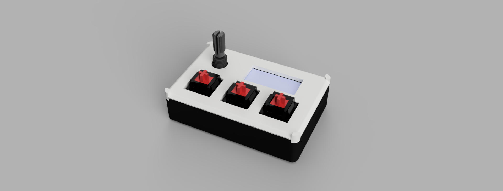
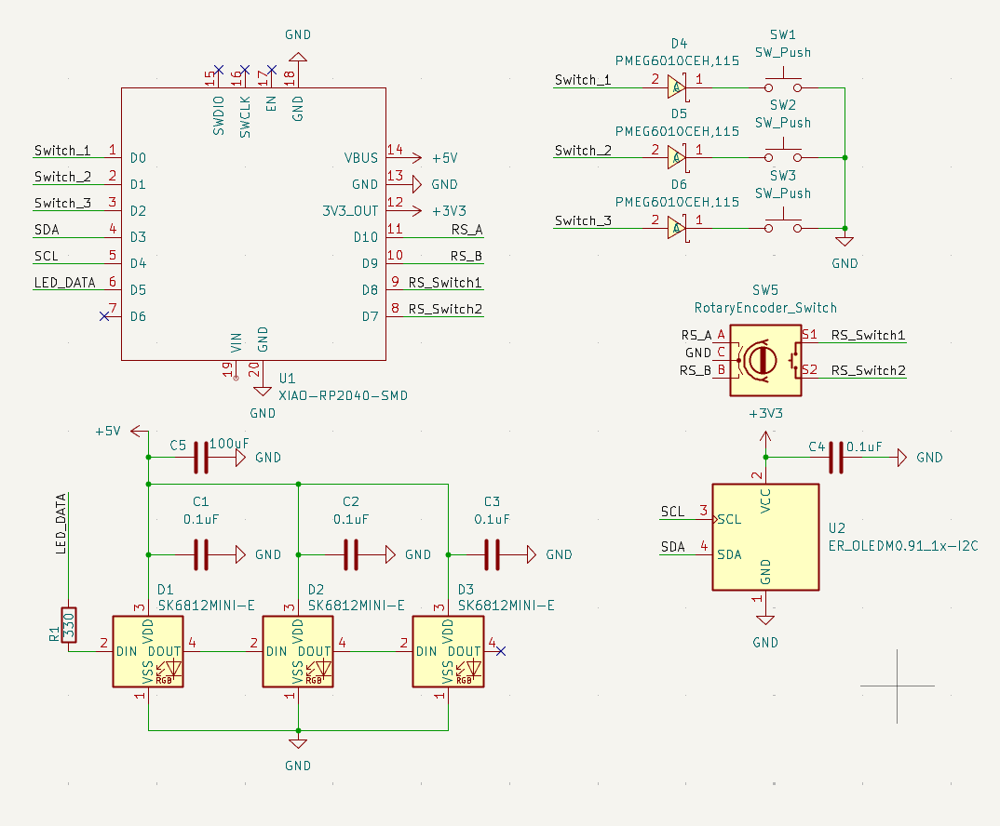
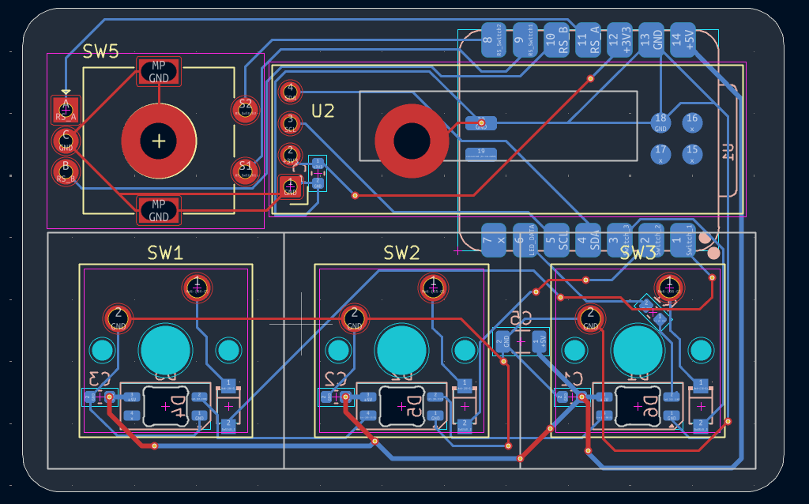

# M-Pad
### Media-Pad (Media-Hackpad)

A Hackpad but this time made for media with 3 dedicated keys for Back, Play/Pause, and Skip along with volume controls via a rotary encoder.
Powered by kmk on circuitpython

    
    

        
        
    

### Case
- The lid is [here](./case/Lid.step)
- The case is [here](./case/Case.step)
- The Custom encoder knob is [here](./case/Encoder_Knob.step)
- The detachable stand that mounts in the two square holes in the back is [here](./case/Detachable_Stand.step)
- Fusion 360 file is [here](https://a360.co/4gD1b6e)

### Key Mappings
---

    

        <strong>Key Switches</strong>
        <table>
            <thead>
                <tr>
                    <th>Function</th>
                    <th>Key</th>
                </tr>
            </thead>
            <tbody>
                <tr><td>Back</td><td>KC.WBAK</td></tr>
                <tr><td>Play/Pause</td><td>KC.MPLY</td></tr>
                <tr><td>Skip</td><td>KC.WFWD</td></tr>
            </tbody>
        </table>
    

    

        <strong>Encoder Mapping</strong>
        <table>
            <thead>
                <tr>
                    <th>Function</th>
                    <th>Key</th>
                </tr>
            </thead>
            <tbody>
                <tr><td>Volume Down</td><td>KC.VOLD</td></tr>
                <tr><td>Volume Up</td><td>KC.VOLU</td></tr>
                <tr><td>Mute</td><td>KC.MUTE</td></tr>
            </tbody>
        </table>
    

### BOM
---
- [BOM](./assets/BOM.csv)
- [LCSC Component BOM](./assets/LCSC_BOM.csv)

### Getting Started
1. Download the latest release of circuitpython from [here](https://downloads.circuitpython.org/bin/seeeduino_xiao_rp2040/en_GB/adafruit-circuitpython-seeeduino_xiao_rp2040-en_GB-10.3.0.uf2)
2. whilst powering the Seeed Studio XIAO RP2040, hold down the boot button and plug it into your computer. The board should show up as a USB drive called `RPI-RP2`.
3. Drag and drop the downloaded UF2 file onto the `RPI-RP2` drive. The board will reboot and show up as a USB drive called `CIRCUITPY`.
4. drag and drop the contents of the [`firmware`](./firmware) folder onto the `CIRCUITPY` drive.
5. Restart the board and it should now be ready to use.

~ Note It is configured for getting stock prices edit the firmware to do as you see fit
~ It uses [main.py](main.py) on the host to communicate over serial

### Soldering Guide
~ Note the capacitors and resistors on the pcb are optional, as they are for decoupling and filtering
1. Use flux on the surface of the pads
2. Place LEDS reverse mounted
3. Solder them
4. Position the diodes with the side with the line facing the same way as in the silk screen
5. Solder them on
6. Solder the ssd1306 oled display (128x32) so the long legs for it stick down
7. Place the m3 screw in the hole then put oled display over top and solder it on
8. Solder on the Xiao
9. solder on the keycaps
10. If you don't have the resistor, bridge the gap using solder
11. push in the EC11E rotary encoder and solder in
12. You're done!!!

### Want to edit the code
1. Hold the middle switch whilst plugging in the board to your computer. The board should show up as a USB drive called `CIRCUITPY`.
2. Edit it as if it is a normal drive. 
